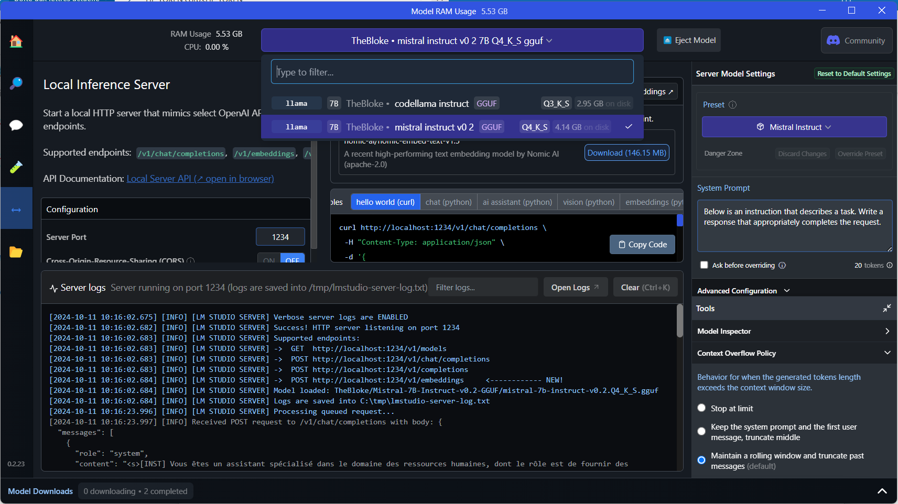

# SantExpo2024

## Copier le projet sur son PC

1- Installer Git et Visual Studio Code

2- Créez un nouveau dossier sur votre ordinateur où vous souhaitez stocker le projet GitLab

3- Lancez Visual Studio Code et ouvrez un nouveau terminal en cliquant sur Terminal > Nouveau terminal dans la barre de menu

4- Dans le terminal, utilisez la commande cd pour naviguer vers le répertoire que vous avez créé à l'étape 2. Par exemple :
```bash
cd /chemin/vers/votre/dossier
```

5- Tout en étant dans le répertoire cible, copiez l'URL du projet GitLab que vous souhaitez cloner. Ensuite, dans le terminal, tapez la commande git clone suivie de l'URL du projet :
```bash
git clone ssh://git@gitlab.mipih.net:32022/idh/santexpo2024.git
```

6- Une fois le clonage terminé, ouvrez le projet dans Visual Studio Code en cliquant sur Fichier > Ouvrir le dossier dans la barre de menu. Ensuite, naviguez jusqu'au dossier du projet et cliquez sur Ouvrir

7- Téléchargez et installez [Python 3.11.9](https://www.python.org/downloads/release/python-3119/) depuis le site officiel. Cochez la case "Add Python to PATH" pendant l'installation pour ajouter Python à votre variable d'environnement PATH

8- Dans Visual Studio Code, accédez à la vue Extensions en cliquant sur l'icône Extensions dans la barre latérale gauche. Recherchez "Python" dans la barre de recherche, puis installez l'extension "Python" développée par Microsoft

9- Dans le terminal (voir étape 3), naviguez jusqu'à l'emplacement de votre projet et créez un environnement virtuel en utilisant la commande suivante : python -m venv env
Cela créera un nouvel environnement virtuel nommé `env` dans un sous-répertoire du répertoire de votre projet

10- Activez l'environnement virtuel en utilisant la commande suivante :
```bash
.\env\Scripts\activate
```
Vous devriez voir `(env)` apparaître dans l'invite de commande, indiquant que l'environnement virtuel est activé

11- Installer toutes les dépendances Python en utilisant pip dans le terminal. Tapez la commande :
```bash
pip install -r requirements.txt
```


## Preparation de l'environnement 

1- HF
Ce poc utilise les apis higging face, il faut donc se créer un compte sur la plateforme puis un token : https://huggingface.co/settings/tokens


2- Avant de lancer le serveur, il faut créer un fichier .env avec deux variables d'environnement :
 
```bash
http_proxy=
HF_TOKEN = "hf_axxxxxxxxxxxxxxxxxxxxxxxx"
```

La première variable précise un éventuel proxy sur le LAN
La seconde variable contient le token hugging face précédemment créé


3- Lancement du serveur LLM

Ce poc utilise LM Studio pour faire tourner le LLM en local. 
Une fois installé, il faut le démarrer.





## Lancement du POC

Ce poc est démontré par une interface WEB lancé sur le navigateur.
les sources de ce projet contiennent donc la page WEB et le serveur HTTP en python.

Le serveur se trouve dans le fichier app.py.

Ci dessous, une trace des logs affichés une fois le serveur démarré et la réception d'une première question par l'utilisateur.

L'interface WEB se trouve : http://127.0.0.1:5000/


```bash
(env) PS C:\projet\ia\gr\santexpo2024> py .\app.py
C:\projet\ia\gr\santexpo2024\src\constant.py:2: LangChainDeprecationWarning: Importing ChatOpenAI from langchain.chat_models is deprecated. Please replace deprecated imports:

>> from langchain.chat_models import ChatOpenAI

with new imports of:

>> from langchain_community.chat_models.openai import ChatOpenAI
You can use the langchain cli to **automatically** upgrade many imports. Please see documentation here <https://python.langchain.com/docs/versions/v0_2/>
  from langchain.chat_models.openai import ChatOpenAI
C:\projet\ia\gr\santexpo2024\utils.py:43: LangChainDeprecationWarning: The class `HuggingFaceEmbeddings` was deprecated in LangChain 0.2.2 and will be removed in 1.0. An updated version of the class exists in the :class:`~langchain-huggingface package and should be used instead. To use it run `pip install -U :class:`~langchain-huggingface` and import as `from :class:`~langchain_huggingface import HuggingFaceEmbeddings``.
  return HuggingFaceEmbeddings(
Chargement des embeddings à partir de OrdalieTech/Solon-embeddings-large-0.1
Chargement de la BD vectorielle avec 937 documents
Client initialisé
 * Serving Flask app 'app'
 * Debug mode: off
WARNING: This is a development server. Do not use it in a production deployment. Use a production WSGI server instead.
 * Running on http://127.0.0.1:5000
Press CTRL+C to quit
127.0.0.1 - - [11/Oct/2024 10:39:07] "GET / HTTP/1.1" 200 -
127.0.0.1 - - [11/Oct/2024 10:39:07] "GET /script.js HTTP/1.1" 304 -
127.0.0.1 - - [11/Oct/2024 10:39:07] "GET /style.css HTTP/1.1" 304 -
127.0.0.1 - - [11/Oct/2024 10:39:07] "GET /manifest.json HTTP/1.1" 404 -
127.0.0.1 - - [11/Oct/2024 10:39:07] "GET /img/icon.png HTTP/1.1" 304 -
127.0.0.1 - - [11/Oct/2024 10:39:09] "GET /service-worker.js HTTP/1.1" 304 -
127.0.0.1 - - [11/Oct/2024 10:39:16] "GET /img/user.png HTTP/1.1" 304 -
faut-il un certificat médical pour enfant malade ?
127.0.0.1 - - [11/Oct/2024 10:39:16] "GET /img/chatbot.jpg HTTP/1.1" 304 -
[0.17609384917133442, 0.16993501449213455, 0.16286631364728144, 0.15601391042898627, 0.15319276897706102, 0.13261659324034558, 0.13022442241256427]
127.0.0.1 - - [11/Oct/2024 10:39:17] "POST /chat HTTP/1.1" 200 -
faut-il un certificat médical pour congé enfant malade d'un agent hospitalier ?
[0.4388281990689695, 0.43108868898321695, 0.4003347236806968, 0.4003000789712208, 0.39249056297009177, 0.39210664732700595, 0.3896916329073318]
Moyenne : 0.4064057905583619
Scores proches du maximum : [0.4388281990689695, 0.43108868898321695]
127.0.0.1 - - [11/Oct/2024 10:39:43] "POST /chat HTTP/1.1" 200 -

```  


## Comment utiliser GIT sur ce projet ?

1- S'il y a eu des modifications sur la branche : 
```bash
git pull
```

2- Vérifiez l'état de votre projet Git en utilisant la commande :
```bash
git status
```
Cela vous montrera les fichiers qui ont été modifiés et qui sont prêts à être commités.

3- Ajoutez des fichiers individuellement en utilisant :
```bash
git add <nom_du_fichier>
```
ou ajouter tous les fichiers modifiés en utilisant :
```bash
git add .
```

4- Pour commiter les fichiers et fournir un message de commit en une seule étape, utilisez :
```bash
git commit -m "<message_de_commit>"
```

5- Poussez les modifications sur le dépôt distant en utilisant :
```bash
git push -uf origin dev
```
